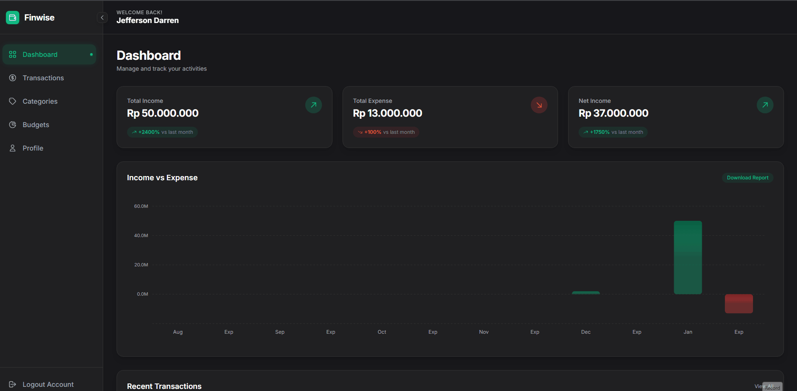

# FinWise - Personal Finance Management Tool

**FinWise** is a web application designed to help users manage their personal finances. The platform allows users to track their **income** and **expenses**, set **budgets**, and get valuable insights into their financial activities. The name "FinWise" comes from the combination of **"Fin"** for finance and **"Wise"** for making smart decisions. The goal of the platform is to help users manage their money wisely and make informed financial choices.

## 📸 Website Preview



## Features Overview

### 1. **Dashboard**
The **Dashboard** is the main page of the application where users can quickly view an overview of their financial activities.

#### Key Components:
- **Total Income**: Displays the total income for the selected period weekly, monthly, yearly. This helps users track how much they have earned.
- **Total Expense**: Shows the total expense for the selected period. It helps users monitor how much they have spent.
- **Net Income**: The difference between total income and total expense, representing the net balance for the selected period.
- **Income vs Expense Graph**: A visual representation of income vs expenses over time.
- **Recent Transactions**: Displays the most recent financial transactions, including both income and expenses, with details like amount, category, and date.

#### Explanation:
The **Dashboard** allows users to easily monitor their financial status by showing key figures such as income, expenses, and net income. Additionally, the graph provides a visual comparison of income versus expenses, while the recent transactions section allows users to see their most recent financial activities at a glance.

### 2. **Transactions**
The **Transactions** section allows users to manage their financial transactions by adding, editing, and viewing them.

#### Key Components:
- **Add Transaction**: A button that opens a form for entering new transactions.
  - **Transaction Form** includes:
    - **Description**: The name or description of the transaction.
    - **Amount**: The monetary value of the transaction.
    - **Type**: Defines whether the transaction is Income or Expense.
    - **Category**: Selects the category of the transaction.
    - **Date**: The date the transaction occurred.
- **List of Transactions**: Shows a list of all transactions, with options to view, edit, or delete each transaction.

#### Explanation:
The **Transactions** section enables users to track their income and expenses in detail. Each transaction is categorized for better organization, and users can quickly add or modify transactions based on their financial activities.

### 3. **Categories**
The **Categories** section is used to organize income and expenses into specific categories for better tracking.

#### Key Components:
- **Category List**: Displays all categories that the user has created like Transport, Healthcare, Salary.
- **Add Category**: A button that opens a form to create a new category, where users can define the category name and specify whether it's an Income or Expense category.
- **Edit/Delete**: Options for each category to edit its name or type (Income/Expense), or delete it.

#### Explanation:
The **Categories** section allows users to categorize their financial transactions, making it easier to track specific types of income and expenses. Categories like Transport, Healthcare, or Salary help users quickly identify the nature of each financial activity.

### 4. **Budgets**
The **Budgets** feature helps users set spending limits for specific categories, allowing them to manage their finances effectively.

#### Key Components:
- **Add Budget**: A button that opens a form where users can set a budget limit for a category, select a period (weekly, monthly, yearly), and save the budget.
  - **Budget Form** includes:
    - **Category**: Choose the category for which the budget is being set.
    - **Budget Limit**: Define the spending limit.
    - **Period**: Select the budget period.
- **Budget List**: Displays a list of all budgets set by the user, showing the category, budget limit, and the remaining balance.

#### Explanation:
The **Budgets** section allows users to set and manage their financial limits for various categories. It helps users control their spending by notifying them once they approach or exceed their set budget.

### 5. **Profile**
The **Profile** section lets users manage their personal information and settings.

#### Key Components:
- **Profile Information**: Displays and allows users to update their name, email, and other personal details.
- **Change Password**: A form to change the account password.
- **Currency Settings**: Option to select the default currency (EUR for Euro, IDR for Indonesian Rupiah, USD for United State Dollar, JPY for Japanese Yen).
- **Update Profile**: A button to save any changes made to the profile.

#### Explanation:
The **Profile** section is where users can manage their account details, such as updating their personal information, changing the password, and setting the preferred currency for financial transactions.

### 6. **Logout**
The **Logout** option at the bottom of the navigation menu allows users to securely log out of the application.

---

## Why "FinWise"?

The name **FinWise** was chosen to reflect the combination of **"Fin"** Finance and **"Wise"** making smart financial decisions. The goal of the platform is to help users track and manage their finances intelligently, making it easier for them to stay on top of their financial health.

---

## Purpose and Benefits

- **Track Income and Expenses**: Easily track your financial transactions, helping you understand where your money is going.
- **Set and Monitor Budgets**: Set budgets for different categories to stay within your financial limits.
- **Personalized Insights**: Get insights into your spending habits with graphs and transaction history.
- **User-Friendly Interface**: Designed to be intuitive and easy to navigate for anyone, regardless of financial experience.

---

## Why Dark Mode?

**Dark Mode** was chosen for the following reasons:
1. **Aesthetic**: Provides a modern, sleek appearance.
2. **User Preference**: Dark mode has become a popular choice among users, offering a more comfortable viewing experience.

---

## Target Audience

**FinWise** is primarily designed for:
- **Individuals** looking to track and manage their personal finances.
- **Freelancers**, **students**, or anyone who needs a simple way to track income and expenses.
- **People seeking financial discipline** through budget tracking and category management.

---

## Advantages Over Other Financial Apps

1. **Simplicity**: A clean and user-friendly interface with a focus on essential features.
2. **Customizable Budgeting**: Unlike many apps, **FinWise** allows users to set budgets for specific categories, offering greater control.
3. **Holistic Financial Management**: Tracks both **income** and **expenses** in one place, unlike other apps that focus on one or the other.
4. **Dark Mode**: Provides comfort for extended use, reducing eye strain.
5. **Personalization**: Customizable categories, profiles, and currency settings for a tailored experience.

---

## Getting Started
```bash
1. Clone the repository:
   git clone https://github.com/KepinTheNoob/Finwise.git
2. composer install
3. php artisan migrate
4. composer dump-autoload
5. php artisan optimize:clear
6. php artisan serve
